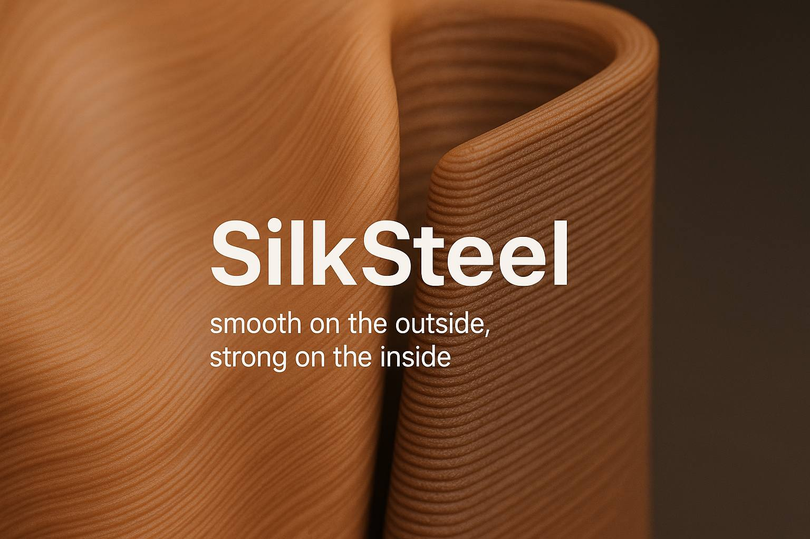
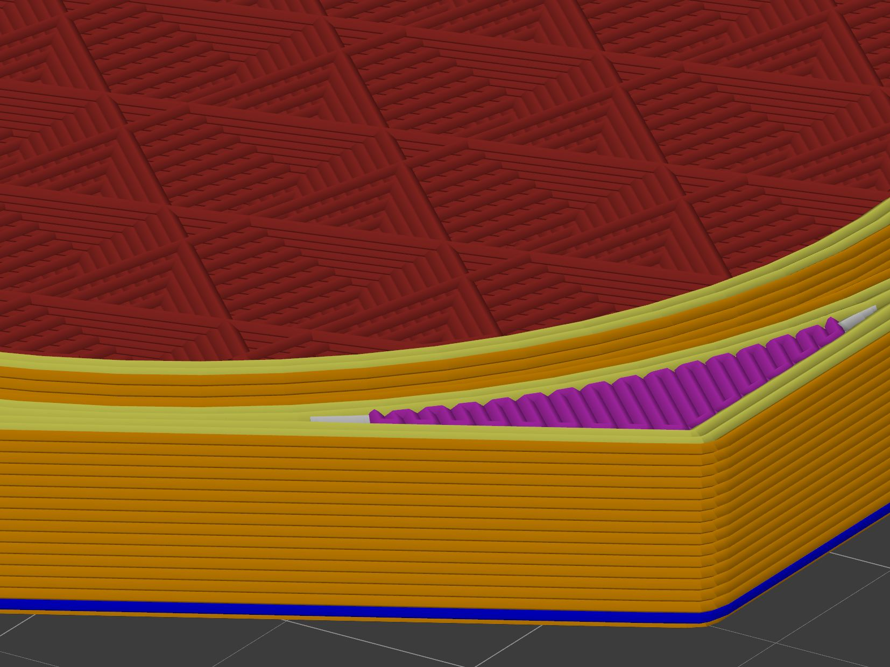
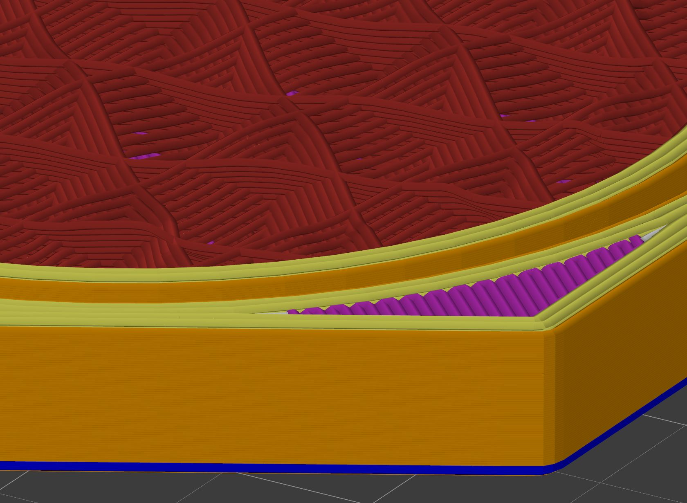
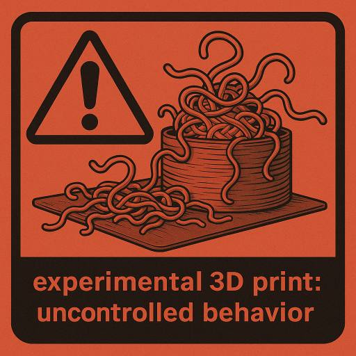

# SilkSteel G-Code Post-Processor [](https://www.paypal.com/donate/?hosted_button_id=VT4P4AT8FTYDL)

**SilkSteel** — *Smooth on the outside, strong on the inside.*

A powerful G-code post-processor that transforms your 3D prints by creating silk-smooth exterior surfaces while building steel-strong internal structures through intelligent layer manipulation.

---

## 🎯 What is SilkSteel?

SilkSteel is an advanced G-code post-processing tool that applies multiple optimization techniques to your sliced files:

- **Smoothificator**: Splits thick external perimeters into multiple ultra-thin passes for glass-smooth surfaces
- **Bricklayers**: Z-shifts alternating internal perimeters to create interlocking "brick pattern" for superior layer adhesion
- **Non-planar Infill**: Modulates Z height during infill printing to mechanically interlock with adjacent layers
- **Valley Filling**: Intelligently fills gaps between infill layers to prevent air pockets and improve strength
- **Safe Z-hop**: Intelligently lifts the nozzle during travel moves to prevent collisions with already-printed geometry
- **Bridge Densifier**: Adds parallel lines to bridges for improved strength and surface quality
- **Gap Fill Removal**: Optionally removes gap fill sections to reduce print time and potential artifacts

The result? Prints with **silk-smooth exteriors** and **steel-strong interiors**.




---


> [!WARNING]
> **⚠️ EXPERIMENTAL SOFTWARE ⚠️**
> 
> This tool is currently in an experimental state and has **not been extensively tested** across all printer configurations, slicers, and G-code variations. While it has shown promising results, you should:
> - **Always preview** the processed G-code in a viewer before printing
> - **Start with small test prints** to validate behavior on your specific setup
> - **Monitor your first prints** closely for any unexpected behavior
> - **Use at your own risk** - we are not responsible for failed prints or hardware damage
> 
> Please report any issues or unexpected behavior on our [GitHub Issues](https://github.com/48design/silksteel-gcode/issues) page to help improve the tool!

---

## ✨ Features

### 🧵 Smoothificator (Enabled by Default)
Creates ultra-smooth external surfaces by splitting thick perimeter walls into multiple thin passes:
- Converts single thick wall (e.g., 0.4mm) into 2-3 ultra-thin passes (e.g., 0.15mm each)
- Each pass is printed at a lower Z height, building up gradually
- Eliminates visible layer lines on vertical surfaces
- Perfect for aesthetic parts, mechanical surfaces, and light-diffusing prints

**Best for:** Visible surfaces, vases, enclosures, decorative parts

### 🧱 Bricklayers (Optional, `-enableBricklayers`)
Strengthens parts by creating a brick-like interlocking pattern with internal perimeters:
- **Layer 0**: All perimeter blocks printed in 2 passes at 0.75h each (total 1.5h)
- **Layer 1+**: Alternating blocks are Z-shifted by +0.5h (shifted) or printed normally (base)
- Creates mechanical interlocking between layers
- Dramatically improves layer adhesion and structural strength
- Properly handles E values and travel moves to prevent artifacts

**Best for:** Functional parts, mechanical components, parts under stress

### 🌊 Non-planar Infill (Optional, `-enableNonPlanar`)
Modulates Z height during infill printing to create 3D wave patterns:
- Infill lines undulate up and down, creating mechanical anchors
- Automatically detects solid layers above/below and respects safe Z boundaries
- Pre-calculates 3D occupancy grid to prevent nozzle collisions
- Two pattern modes: sine waves or Perlin noise
- Significantly improves infill-to-perimeter bonding

**Best for:** Large flat surfaces, parts with sparse infill, structural components

### 🏔️ Valley Filling (Automatic with Non-planar Infill)
Intelligently fills the gaps (valleys) created by non-planar infill:
- Detects when infill dips below the current layer height
- Automatically fills valleys with multiple passes, building back up to layer height
- Creates gaps at infill crossing points to prevent over-extrusion
- Only the last crossing gets filled to minimize collisions
- Uses 50% extrusion rate for gradual valley filling
- Dramatically improves strength by eliminating air pockets between layers

**Best for:** Automatically enabled with non-planar infill - no configuration needed!

### 🛡️ Safe Z-hop (Enabled by Default)
Prevents nozzle collisions during travel moves:
- Pre-calculates maximum Z height per layer
- Lifts nozzle to `max_z + margin` before travel moves
- Only activates after first layer to avoid startup issues
- Configurable safety margin (default: 0.5mm)
- Essential when using Bricklayers or Non-planar features

Notes and heuristics:
- The Z-hop logic samples the same non-planar LUT used by the infill to compute an accurate maximum Z along each travel path and adds the configured margin.
- The processor will never insert a lift during bridge infill sections or wipe sequences (it recognizes `;TYPE:Bridge infill` and `;WIPE` markers). However, drops (lowering back to printing height) are still inserted before the next extrusion so the nozzle never prints mid-air.
- To exclude particular wipe/comment conventions from suppression, you can edit the script or add explicit `;WIPE_START` / `;WIPE_END` markers in slicer post-processing.

**Best for:** All prints, especially with Z-shifting features enabled

### 🌉 Bridge Densifier (Optional, `-enableBridgeDensifier`)
Strengthens bridge sections by adding parallel extrusion lines:
- Automatically detects bridge infill sections in G-code
- Creates parallel edge lines along each bridge extrusion
- Uses serpentine path optimization for minimal travel
- Generates intermediate lines between long bridge pairs
- Handles single isolated bridge lines by creating 3 parallel copies
- Dramatically improves bridge strength and surface quality
- Maintains proper E values and uses travel moves for long connectors

**Best for:** Parts with long bridges or many overhangs

### 🔧 Gap Fill Removal (Optional, `-enableRemoveGapFill`)
Removes gap fill sections from G-code:
- Detects and removes ";TYPE:Gap fill" sections
- Can reduce print time by skipping thin gap-filling passes
- May improve surface quality by eliminating potential artifacts from gap fill
- Useful when gap fill causes problems or isn't needed
- Position tracking maintained even when gap fill is removed

**Best for:** Prints where gap fill causes artifacts or isn't structurally necessary

**Note:** Gap fill is often useful for sealing small gaps. Only remove it if you're experiencing issues or want faster prints.

---

## 📦 Installation

### Requirements
- Python 3.7+
- NumPy (for non-planar noise generation)
 - Pillow (optional) — required only for visualization (`-debug-full`) and PNG generation

### Setup
```bash
# Clone or download this repository
git clone https://github.com/48design/silksteel-gcode.git
cd silksteel-gcode

# Install dependencies
pip install numpy
# Optional: install Pillow for visualization features
pip install pillow
```

---

## 🚀 Usage

### Basic Usage (Smoothificator only)
```bash
python SilkSteel.py input.gcode -o output.gcode
```

### Enable All Features
```bash
python SilkSteel.py input.gcode -o output.gcode -full
```

### Custom Feature Combinations
```bash
# Smoothificator + Bricklayers only
python SilkSteel.py input.gcode -o output.gcode -enableBricklayers

# All features with custom settings
python SilkSteel.py input.gcode -o output.gcode -full -amplitude 1.5 -frequency 8

# Full mode but disable gap fill removal
python SilkSteel.py input.gcode -o output.gcode -full -disableRemoveGapFill

# Full mode but disable bridge densifier (if causing issues)
python SilkSteel.py input.gcode -o output.gcode -full -disableBridgeDensifier

# Bricklayers with reduced extrusion on shifted blocks
python SilkSteel.py input.gcode -o output.gcode -enableBricklayers -bricklayersExtrusion 0.9
```

### In-Place Mode (For Slicer Integration)
```bash
# Modifies the input file directly (required for slicer post-processing scripts, gcode automagically 🧙 added by slider)
"{fielpath-to-your-python.exe}" "{path-to-silksteel}\SilkSteel.py" -full
```

---

## 🛠️ Command-Line Options

### Input/Output
```
input_file              Input G-code file (required)
-o, --output           Output file (if omitted, modifies input file in-place)
```

### Feature Toggles
```
-full, --enable-all                Enable all features (Bricklayers + Non-planar + 
                                   Bridge Densifier + Gap Fill Removal)
-enableBricklayers                 Enable Bricklayers Z-shifting (default: disabled)
-disableBricklayers                Disable Bricklayers (overrides -full)
-enableNonPlanar                   Enable non-planar infill (default: disabled)
-disableNonPlanar                  Disable non-planar infill (overrides -full)
-enableBridgeDensifier             Enable bridge densifier (default: disabled)
-disableBridgeDensifier            Disable bridge densifier (overrides -full)
-enableRemoveGapFill               Enable gap fill removal (default: disabled)
-disableRemoveGapFill              Disable gap fill removal (overrides -full)
-disableSmoothificator             Disable Smoothificator (default: enabled)
-disableSafeZHop                   Disable safe Z-hop (default: enabled)
```

### Smoothificator Settings
```
-outerLayerHeight MODE|FLOAT       Height for outer wall passes:
                                   "Auto" = min(first_layer, base_layer) * 0.5 (default)
                                   "Min" = uses min_layer_height from G-code
                                   FLOAT = explicit value in mm (e.g., 0.1)
                                   
                                   Examples:
                                   -outerLayerHeight Auto    → Smart default
                                   -outerLayerHeight Min     → Ultra-fine (slow)
                                   -outerLayerHeight 0.12    → Manual control
```

### Bricklayers Settings
```
-bricklayersExtrusion FLOAT        Extrusion multiplier for shifted blocks
                                   (default: 1.0, try 0.9-1.1 for tuning)
```

### Non-planar Infill Settings
```
-deformType {sine,noise}           Pattern type (default: sine)
                                   sine: smooth wave patterns
                                   noise: Perlin noise for organic variation
-segmentLength FLOAT               Line subdivision length in mm (default: 0.64)
-amplitude INT|FLOAT               Z modulation amplitude (default: 4)
                                   INT = number of layer heights (e.g., 4 → 4 layers)
                                   FLOAT = explicit value in mm (e.g., 2.5 → 2.5mm)
                                   Higher = more pronounced waves
-frequency FLOAT                   Pattern frequency (default: 8)
                                   Higher = tighter waves
-nonplanarFeedrateMultiplier FLOAT Feedrate boost for non-planar moves (default: 1.1x)
-disableAdaptiveExtrusion          Disable adaptive extrusion (default: enabled)
-adaptiveExtrusionMultiplier FLOAT Extrusion boost per layer of Z-lift (default: 1.5x)
                                   Controls extra material for bonding when lifting
                                   Example: 1 layer lift = 1.5x extrusion
                                            2 layer lift = 3.0x extrusion
```

### Safe Z-hop Settings
```
-safeZHopMargin FLOAT              Safety margin above max Z in mm (default: 0.5)
```

### Bridge Densifier Settings
```
-bridgeMinLength FLOAT             Minimum bridge line length to densify in mm (default: 2.0)
-bridgeMaxSpacing FLOAT            Maximum spacing between parallel bridge lines in mm (default: 0.9)
-bridgeConnectorMaxLength FLOAT    Maximum connector length before using travel move in mm (default: 5.0)
```

### Debug Options
```
-debug                             Enable basic debug mode: console output only
-debug-full                        Enable full debug mode: console output + 
                                   visualization files (3D grid G-code + PNG images)
                                   
                                   Generates:
                                   - grid_visualization.gcode: 3D wireframe showing
                                     detected solid cells and cross-sections
                                   - layer_XXX_zYY.YY.png: Per-layer images showing
                                     solid occupancy grid (white = solid, black = air)
                                   - SilkSteel_log.txt: Detailed processing log
```

---

## 📋 Workflow & Best Practices

### Slicer Settings
1. **Slice your model normally** with your preferred settings
2. Use **variable layer heights** if desired (SilkSteel handles them correctly)
3. For Smoothificator: Set external perimeter extrusion width to 0.4-0.5mm
4. For Bricklayers: Enable at least 2 perimeters
5. For Non-planar: Use 10-20% infill with rectilinear or grid pattern
6. For Bridge Densifier: Enable "Detect bridging perimeters" in slicer (usually default)

### Recommended Feature Combinations

**Display Parts (Focus: Appearance)**
```bash
python SilkSteel.py model.gcode -o output.gcode
# Smoothificator only - perfect surface finish
```

**Functional Parts (Focus: Strength)**
```bash
python SilkSteel.py model.gcode -o output.gcode -enableBricklayers
# Smoothificator + Bricklayers - strong and smooth
```

**Large Structural Parts (Focus: Maximum Strength)**
```bash
python SilkSteel.py model.gcode -o output.gcode -full
# All features - ultimate strength with good finish
```

### Processing Time
- Small prints (< 50 layers): < 5 seconds
- Medium prints (50-200 layers): 10-30 seconds  
- Large prints (200+ layers): 30-90 seconds
- Non-planar infill adds 20-50% processing time due to 3D grid calculations

---

## 🔧 Integration with Slicers

### PrusaSlicer / SuperSlicer
1. Go to: **Print Settings → Output options → Post-processing scripts**
2. Add: `python "C:\path\to\SilkSteel.py"`
3. The script will modify the G-code file in-place after slicing

### Cura
1. Go to: **Extensions → Post Processing → Modify G-Code**
2. Add script: **Run a script after slicing**
3. Set path: `python "C:\path\to\SilkSteel.py" "[output_file]"`

### OrcaSlicer
1. Go to: **Printer Settings → Machine G-code → Post-process script**
2. Add: `python "C:\path\to\SilkSteel.py"`

---

## 📊 Technical Details

### How Smoothificator Works
1. Detects external perimeter blocks via TYPE comments
2. Determines target layer height:
   - **Auto mode** (default): Uses `min(first_layer_height, base_layer_height) * 0.5`
   - **Min mode**: Uses `min_layer_height` from adaptive layer settings
   - **Manual**: Uses specified float value
3. Calculates number of passes needed based on outer_layer_height
4. Splits perimeter into multiple passes, each at incrementing Z
5. Adjusts extrusion per pass to maintain proper wall thickness
6. Handles wipe moves and travel moves correctly

### How Bricklayers Works
1. Detects internal perimeter blocks
2. On layer 0: All blocks printed in 2 passes (0.75h + 0.75h)
3. On layer 1+: Alternates between shifted (+0.5h) and base (normal Z)
4. Uses G92 E0 resets to maintain proper E value tracking
5. Reduces extrusion to 0.5x on shifted blocks of the last layer (to end flat)

### How Non-planar Infill Works
1. **Pass 1: Build 3D Occupancy Grid**
   - Scans entire G-code to detect all solid layers (perimeters, solid infill, bridges)
   - Tracks extrusion moves (G1 with E parameter) within solid TYPE sections
   - Detects retractions (E < 0.01) to break continuity across travel moves
   - Uses DDA algorithm to mark all grid cells (default: 0.5mm resolution) along extrusion paths
   - Creates accurate 3D map of where solid material exists

2. **Pass 2: Calculate Safe Z Ranges**
   - For each XY grid cell, analyzes solid layers above and below
   - Calculates safe Z ranges (gaps between solid layers)
   - Stores min/max safe Z per grid cell to prevent collisions

3. **Pass 3: Process Infill with Z Modulation & Valley Filling**
   - Subdivides infill lines into small segments
   - Applies sine wave or Perlin noise pattern to calculate target Z
   - Clamps Z values to safe range for each grid cell
   - **Valley Detection**: When Z drops below layer height, enters valley mode
   - **Valley Filling**: Collects all segments in valley, then fills with multiple passes
   - **Crossing Detection**: Skips valley fill at infill crossing points (except last one)
   - **Smart Gaps**: Creates gaps where infill lines cross to prevent collisions
   - **Crossing Countdown**: Decrements crossing count after each valley passes through
   - Updates E values proportionally to actual 3D line length
   - Boosts feedrate for non-planar moves

4. **Collision Avoidance**
   - Constantly checks grid to ensure nozzle stays in safe Z range
   - Prevents crashes into already-printed perimeters or solid layers
   - Handles variable layer heights and complex geometries

### Grid Resolution & Accuracy
- Default: **0.5mm** grid cells (configurable via `GRID_RESOLUTION` constant)
- Finer grid = more accurate collision detection, slower processing
- Coarser grid = faster processing, less precise safe zones
- Uses floor division for consistent cell assignment
- DDA line-drawing algorithm ensures no cells are skipped

### How Safe Z-hop Works
1. Pre-calculates maximum Z per layer during first scan pass
2. Before each travel move (G1 with X/Y but no E), lifts to max_z + margin
3. Only activates after first layer starts
4. Returns to normal Z after travel completes

### How Bridge Densifier Works
1. Detects bridge infill sections and buffers all bridge lines
2. Identifies parallel line pairs and creates edge lines offset perpendicular to bridge direction
3. For single isolated lines: creates 3 parallel copies (LEFT, MIDDLE, RIGHT)
4. Generates intermediate lines between paired lines when spacing allows
5. Connects all lines using serpentine path optimization (always choose closest endpoint)
6. Uses G0 travel for long connectors (>5mm), G1 extrusion for short connectors
7. Maintains proper E values throughout, minimizes E mode switching

---

## 🐛 Troubleshooting

### Issue: Rough surfaces after Smoothificator
**Solutions**: 
- Decrease outer_layer_height (try `-outerLayerHeight 0.1` or `0.12`)
- Use Auto mode (default) for balanced results
- Use Min mode (`-outerLayerHeight Min`) for ultra-smooth but slower prints

### Issue: First layer too thin/adhesion problems
**Solution**: 
- Use Auto mode (default) instead of Min mode
- Auto mode avoids splitting thin first layers into ultra-tiny passes
- Manual override: `-outerLayerHeight 0.15` for thicker passes

### Issue: Weak Bricklayers shifting
**Solution**: Increase bricklayers_extrusion multiplier to 1.05-1.1

### Issue: Non-planar infill colliding with walls
**Solution**: Reduce amplitude or check grid detection with `-debug-full` flag to visualize solid occupancy

### Issue: Valleys not filling properly / Air pockets in print
**Solution**: Valley filling is automatic with non-planar infill - ensure you're using `-enableNonPlanar` or `-full`

### Issue: Over-extrusion at infill crossings
**Solution**: This is now prevented by the crossing detection system - gaps are automatically created at crossing points except the last one

### Issue: Grid shows solid where there shouldn't be any
**Solution**: This was fixed - script now detects retractions (E < 0.01) and breaks tracking across travel moves

### Issue: Want to see what the grid looks like
**Solution**: Use `-debug-full` to generate PNG images and 3D grid visualization G-code

### Issue: Stringing or blobs on travels
**Solution**: Safe Z-hop should prevent this - check that it's enabled

### Issue: Bridges sagging or weak
**Solution**: Enable Bridge Densifier with `-enableBridgeDensifier` or `-full`. If still weak, adjust slicer bridge settings (speed, flow, fan)

### Issue: Over-extrusion on bridge edges
**Solution**: This is rare but can happen with very thin bridges - bridge densifier can be left disabled if needed

### Issue: Bridge processing taking too long
**Solution**: Increase `-bridgeMinLength` to skip short bridges

### Issue: First layer problems
**Solution**: Safe Z-hop intentionally skips first layer to avoid issues

### Issue: Print time significantly increased
**Solution**: Non-planar adds many small moves - reduce frequency or disable for faster prints

---

## 🙏 Credits & Acknowledgments

SilkSteel is developed and maintained by 48DESIGN GmbH (Fabian Groß).

Company:
- 48DESIGN GmbH
- Karlsruhe, Germany

Contact & Support:
- Website: https://www.48design.com
- Issues / Feature Requests: https://github.com/48design/silksteel-gcode/

Special thanks to Roman Tenger for the original concepts and inspiration:
- Smoothificator technique for multi-pass external perimeters
- Bricklayers Z-shifting concept for improved layer bonding
- Non-planar infill modulation for mechanical interlocking

SilkSteel represents a complete rewrite and optimization of these concepts, with significant enhancements:
- Proper E value tracking and G92 E0 resets for Bricklayers
- 3D occupancy grid system for safe non-planar infill
- Safe Z-hop collision avoidance
- Robust TYPE marker detection and travel move handling
- Performance optimizations for large files

---

## 📄 License

This program is free software: you can redistribute it and/or modify it under the terms of the GNU General Public License as published by the Free Software Foundation, either version 3 of the License, or (at your option) any later version.

This program is distributed in the hope that it will be useful, but WITHOUT ANY WARRANTY; without even the implied warranty of MERCHANTABILITY or FITNESS FOR A PARTICULAR PURPOSE. See the GNU General Public License for more details.

You should have received a copy of the GNU General Public License along with this program. If not, see <https://www.gnu.org/licenses/>.

**Copyright (c) [2025] [48DESIGN GmbH - Fabian Groß]**

---

## 🔗 Links & Resources

- GitHub Repository: [48design/silksteel-gcode]
- Issues & Feature Requests: [GitHub Issues]
- Original Smoothificator concept: [github.com/TengerTechnologies]

---

## 🌟 Contributing

Contributions are welcome! Please feel free to submit pull requests or open issues for bugs and feature requests.

---

**Made with ❤️ and 🧠 and 🤖 for the 3D printing community.**
If this project helps you creating even more awesome 3D prints and if you want to help us improve this and other tools, you can sponsor us a cup of :coffee: - or two! :)
[donate](https://www.48design.com/donate/)

---

